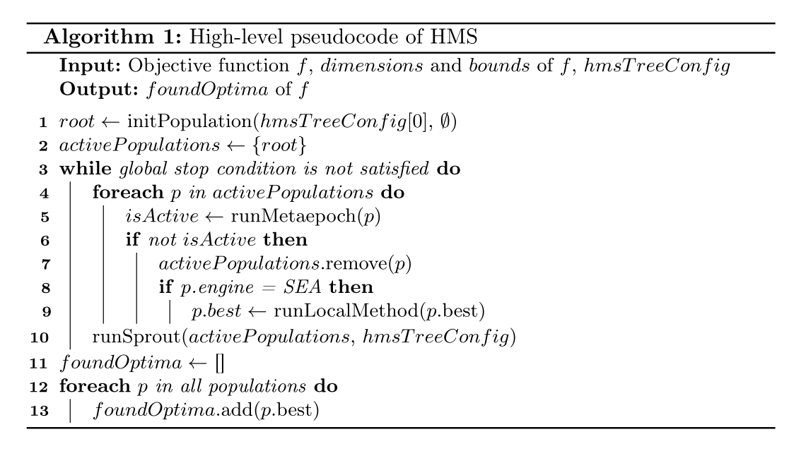

Hierarchic Memetic Strategy (HMS)
=================================

The HMS is a strategy that manages multiple populations (called `demes`) of solutions to a problem,
each group evolving independently according to its own set of rules.
Imagine it as a tree where each deme evolves separately but is part of a bigger structure with a single starting point (root).
This tree is organized in levels, and each level can work a bit differently because it has its own settings or parameters.
A single step of the strategy, called metaepoch, consists of a series of executions in each deme.
HMS can utilize various optimization algorithms as deme engines. Currently we support:

* Differential Evolution (DE),
* Covariance Matrix Adaptation Evolution Strategy (CMA-ES),
* Simple Evolutionary Algorithm (SEA),
* Local Optimization Method (e.g. L-BFGS-B).

The strategy is designed to be flexible and easy to extend. It is possible to add new deme engines or modify the existing ones.
HMS is designed to perform chaotic search on high levels (e.g. at the root level) to look for promising regions and high-precision search on the lower levels.
This way it inherently balances between exploration and exploitation.

Each deme lifecycle is managed by three main components:

* Local Stop Condition (LSC) - a condition that stops the deme,
* Global Stop Condition (GSC) - a condition that stops the whole strategy,
* Sprouting Condition (SC) - a condition that allows the deme to create a new deme at a lower level.

Please see the :ref:`sprout_conditions` and :ref:`stop_section` for more information.

Refer to the :ref:`hms_bib` for more information about the Hierarchic Memetic Strategy.

.. _hms_bib:

Relevant literature
-------------------

#. J. Sawicki, M. Łoś, M. Smołka, R. Schaefer. Understanding measure-driven algorithms solving irreversibly ill-conditioned problems. Natural Computing 21:289-315, 2022. doi: `10.1007/s11047-020-09836-w <https://doi.org/10.1007/s11047-020-09836-w>`_
#. J. Sawicki, M. Łoś, M. Smołka, J. Alvarez-Aramberri. Using Covariance Matrix Adaptation Evolutionary Strategy to boost the search accuracy in hierarchic memetic computations. Journal of computational science, 34, 48-54, 2019. doi: `10.1016/j.jocs.2019.04.005 <https://doi.org/10.1016/j.jocs.2019.04.005>`_
#. H. Guzowski, M. Smołka. Configuring a Hierarchical Evolutionary Strategy Using Exploratory Landscape Analysis. Proceedings of the Companion Conference on Genetic and Evolutionary Computation. 2023. doi: `10.1145/3583133.3596403 <https://doi.org/10.1145/3583133.3596403>`_
#. M. Sokół, M. Smołka. Application of the Hierarchic Memetic Strategy HMS in Neuroevolution. International Conference on Computational Science. Cham: Springer International Publishing, 2022. doi: `10.1007/978-3-031-08754-7_49 <https://doi.org/10.1007/978-3-031-08754-7_49>`_