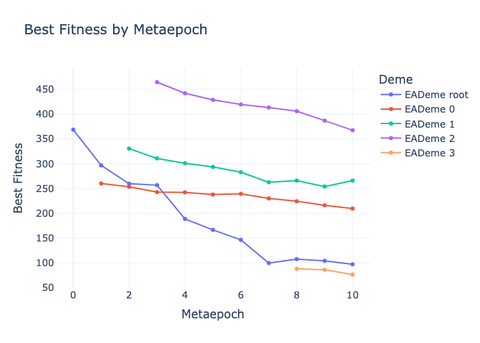
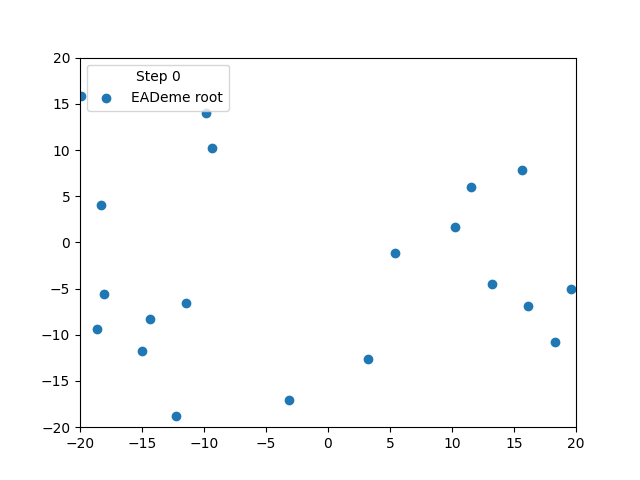

Inspecting results
==================

Visualizing and inspecting the results of evolutionary strategies (ES) are crucial practices in computational intelligence.
Visualization helps in understanding how solutions evolve over generations.
Through visual inspection, one can observe if the population is converging towards a global optimum or if it is stuck in local optima.
Visualization of the population distribution over time can also highlight issues with diversity, indicating whether the evolutionary strategy is exploring the solution space adequately.
`pyhms` provides different methods for `DemeTree` object that enable inspecting results.
Let's consider Sphere function as an example for `N=5`.

.. code-block:: python

    import numpy as np
    from leap_ec.problem import FunctionProblem
    from pyhms import EALevelConfig, hms, get_NBC_sprout, DontStop, MetaepochLimit, SEA

    N = 5
    square_problem = FunctionProblem(lambda x: sum(x**2), maximize=False)
    square_bounds = np.array([(-20, 20)] * N)

    config = [
        EALevelConfig(
            ea_class=SEA,
            generations=2,
            problem=square_problem,
            bounds=square_bounds,
            pop_size=20,
            mutation_std=1.0,
            lsc=DontStop(),
        ),
        EALevelConfig(
            ea_class=SEA,
            generations=4,
            problem=square_problem,
            bounds=square_bounds,
            pop_size=10,
            mutation_std=0.25,
            sample_std_dev=1.0,
            lsc=DontStop(),
        ),
    ]
    global_stop_condition = MetaepochLimit(limit=10)
    sprout_condition = get_NBC_sprout(level_limit=4)
    hms_tree = hms(config, global_stop_condition, sprout_condition)

The easiest way to inspect the result is to use summary function.

.. code-block:: python

    print(hms_tree.summary())

.. code-block:: text

    Hello, Sphinx!
    Metaepoch count: 10
    Best fitness: 4.0969e+01
    Best individual: [-0.98073221  5.60137768  1.90436279  0.36727929  2.20676164]
    Number of evaluations: 1100
    Number of demes: 4

    Level 1.
    Best fitness: 4.4035e+01
    Best individual: [-2.18605631  5.04397642 -0.13939482 -3.07911958  2.07694541]
    Number of evaluations: 400
    Number of demes: 1

    Level 2.
    Best fitness: 4.0969e+01
    Best individual: [-0.98073221  5.60137768  1.90436279  0.36727929  2.20676164]
    Number of evaluations: 700
    Number of demes: 3

    EADeme root f(-2.19, 5.04, -0.14, -3.08, 2.08) ~= 4.40e+01 evals: 400
    ├-- EADeme 0 f(-0.95, 7.80, -0.46, -5.37, 2.35) ~= 9.64e+01 sprout: (-3.16, 9.23, -1.03, -6.96, 3.86); evals: 340
    ├-- EADeme 1 f(-7.85, 5.28, -3.02, 6.66, -4.04) ~= 1.59e+02 sprout: (-9.32, 7.59, -4.32, 7.31, -4.60); evals: 300
    └-- EADeme 2 *** f(-0.98, 5.60, 1.90, 0.37, 2.21) ~= 4.10e+01 sprout: (-2.18, 6.20, 2.09, -0.30, 2.38); evals: 60

To easily investigate the performance of each deme in the tree, we can use the `plot_best_fitness` method.

.. code-block:: python

    hms_tree.plot_best_fitness()

We can also generate an animation presenting populations of all demes.

.. code-block:: python

    hms_tree.animate("your_path.gif")

By default for each individual in the population, the first two dimensions are used to visualize the population.
To change this behaviour, please specify the `dimensionality_reducer` parameter.

.. code-block:: python

    from sklearn.decomposition import PCA
    hms_tree.animate(filepath="your_path.gif", dimensionality_reducer=PCA(n_components=2))

In case of 2D problems, we can visualize the problem itself by `plot_problem`.

.. code-block:: python

    hms_tree.plot_problem_surface()

